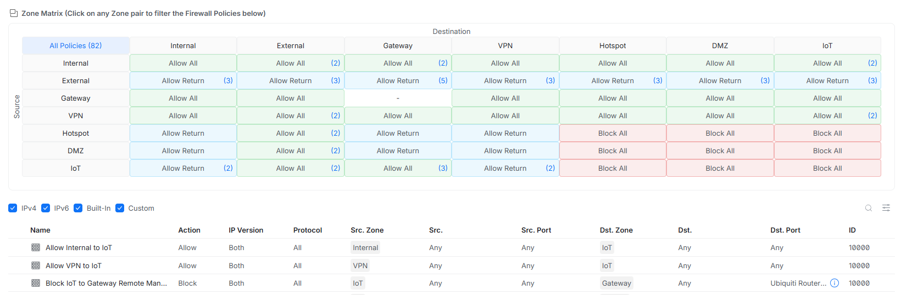

# Unifi-UX7
This is a guide to setting up and securing a Ubiquiti Unifi UX7 for Home Office Use.

It utilises the new zone based firewall.

[Browse recommended products on amazon](https://amzn.to/4diDgac)

## Preparation

#### Factory Reset
Hold the reset pin in for ~10 seconds a factory reset message should display

#### Unfi App (Android/iOS)
Install the `Unifi` app on your phone or tablet.

## Connecting

### Adoption

1. Plug in the Router and wait for it to boot.
2. Open the `Unifi` App and when the router appears click setup.
3. When prompted choose to setup a new network/site.
4. Enter the site name and wifi name and password.

### Login
1. Login to `Unifi Site Manager` https://unifi.ui.com
2. From Site manager click `Control Plane` under the device or cick the device name, then click the cog in the bottom left of the screen/menu.

## Configuration

### Networks/VLANs

1. Click Networks left menu item
2. Click New Virtual network and enter the details (Create Main VLAN)
   |   |    |
   | -- | -- |
   | Name | Main |
   | Auto-Scale Network | De-select |
	 | IPv4 Address | 192.168.100.1/24 |
   | VLAN ID | 100 |
3. Click `Create`.
4. Click New Virtual network and enter the details (Create IoT VLAN)
   |   |    |
   | -- | -- |
   | Name | IoT |
   | Auto-Scale Network | De-select  |
   | IPv4 Address | 192.168.101.1/24 |
   | VLAN ID | 101 |
6. Click `Create`.

### Zones (VLAN Firewal Rules)

1. Click `Traffic and Firewall Rules` under `Policy Engine` menu heading.
2. Under `Upgrade to Zone-Based Firewall` click `Click to upgrade`.
3. Under `Zones` click `Create Zone` and enter details
   |   |   |
   | -- | -- |
   | Zone Name | IoT |
   | Networks / Interfaces > IoT | Check and Save |
4. Click `Add Entry`.
5. In the `Zone Matrix` click `All Policies (…)`.
6. Then at the bottom of the policies click `Create Policy` and enter the details (Internal to IoT):
   |   |    |
   | -- | -- |
   | Name | Allow Internal to IoT |
   | Source Zone | Internal |
   | Action | Allow |
   | Auto Allow Return Traffic | Checked/On |
   | Destination Zone | IoT |
7. Click Add Policy
8. Then at the bottom of the policies click `Create Policy` and enter the details (VPN to IoT):
   |  |  |
   | -- | -- |
   | Name | Allow VPN to IoT |
   | Source Zone | VPN |
   | Action | Allow |
   | Auto Allow Return Traffic | Checked/On |
   | Destination Zone | IoT |
9. Click Add Policy
10. Then at the bottom of the policies click `Create Policy` and enter the details (Block IoT from accessing router management features):
    |  |  |
    | -- | -- |
    | Name | Block IoT to Gateway Remote Management |
    | Source Zone | IoT |
    | Action | Block |
    | Destination Zone | Gateway |
    | Port | List |
11. In `Port List` click `Create New` and enter the details
    |  |  |
    | -- | -- |
    | Name | Ubiquiti Router Remote Management |
    | Ports | `80`,`443`,`22`,`5349`,`8443` |
12. Click `Create`.
13. Click `Add Policy`.

The zones should look like this:

### Ports
Since the UX7 only has one LAN port it must always act as a Trunk Port and can only be native to the Default VLAN 1 ( This is a device limitation).

1. Click the `Overview` left hand menu item
   1. Under `Ethernet Port Profiles` click `Create New` and enter:
      |  |  |
      | -- | -- |
      | Name | Switch Trunk Port |
      | Port | Active |
      | Native  VLAN | Default (1) |
      | Tagged VLAN Management | Allow All |
   2. Then Click `Apply Changes` at bottom of screen.
3. Select `Ports` Icon from left menu near top
4. Click the `LAN Port` (Port 1)
5. Under `Advanced` switch to `Manual`.
6. Check `Ethernet Port Profile`.
7. Select the `Switch Trunk Port Profile`.
8. Click `Apply Changes`.

### Security
1. Click `CyberSecure` and choose `Protection` tab at top.
2. Tick `Region Blocking` and enter
   1. Select `Block`
   2. Select ` Both directions`
   3. Select `Country or Territory` and add
	  - `Russia`, `China`, `Iran`
4. `Encrypted DNS` Select `Predefined`
	1. Clear existing entries
	2. Select the following then `Save`.
	   1. `Cloudflare-security`
	   2. `Quad9-doh-ip4-port443-filter-ecs-pri`
5. Identification: `Device and Traffic`.
6. Intrusion Prevention: `On`.
	1. Selected Networks: `Default`,`Main`,`IoT`.
	2. Detection Mode: `Notify and Block`.
7. Click `Apply Changes`.
8. Click `CyberSecure` and choose `Content Filter` tab at top.
   |  |  |
   | -- | -- |
   | Name | Content Filtering |
   | Source | `IoT`,`Main`,`Default` |
   | Ad Block | Checked |
   | Filtering | Basic |
   | Schedule | Always |
9. Click `Add` at bottom of page.

### WiFi
1. Click Wifi in side menu
2. Click Manage and remove the default Wifi network
3. Click Create New and enter (Main Wifi):
	1. Name: *Your Main WiFi Name*
	2. Password: ***Main WiFi Password***
	3. Network: `Main`
	4. Wifi Optimization: `Standard`
	5. Click Create
4. Click Create New and enter (IoT Wifi):
	1. Name: *IoT WiFi Name*
	2. Password: ***IoT WiFi Password***
	3. Network: `IoT`
	4. Wifi Optimization: `IoT`
	5. Click `Create`.

 ### QoS
1. Select the Dashboard Icon at the top left of screen
2. On the left in the Critical Traffic Prioritization box select Configure
3. Under QoS Rules click Create Policy and enter
   1. Select: QoS
   2. Name: Calling VPN Games
   3. QoS Behavior: Prioritize
   4. Interface: Internet 1
   5. Source: Any
   6. Destination: App
	  1. Select Category
	  2. Select items `Instant Messengers`, `VoIP Services`, `Online Games`, `Tunneling and Proxy Services`
   7. Schedule: `Always`
   8. Click `Add`.

### Auto Updates
1. Select `Control Plane` in left menu and select the `Updates` tab at top of page
2. Click `UX7` row under `UniFi OS`, then
	1. Release Channel: `Official`
	2. Auto-Update: `Checked`
       |  |  |
       | -- | -- |
       | Repeats | Weekly |
       | At | 2AM |
	   | On Day of Week | Sat |
	3. Click `Apply Changes`.
3. Click `Network` row under `Application`, then
	1. Release Channel: `Official`
	2. Application Auto-Update: Checked
       |  |  |
       | -- | -- |
       | Repeats | Weekly |
       | At | 3AM |
	   | On Day of Week | Sat |
	3. Click `Apply Changes`.

### Backups
1. Select `Control Plane` in left menu and select the `Backups` tab at top of page
2. `Auto (Weekly)` Checked

## Reference

[Lazy Admin Unifi Zone Based Firewall](https://lazyadmin.nl/home-network/unifi-zone-based-firewall/)
A good guide to understanding the Zone Based firewall. Just note that it does not fully explain putting the IoT network into the IoT Zone. I found it easiest to add an IoT zone and putt the IoT Network/VLAN into it. Then the rules show on the Zone matrix correctly and less rules/policy is needed.
